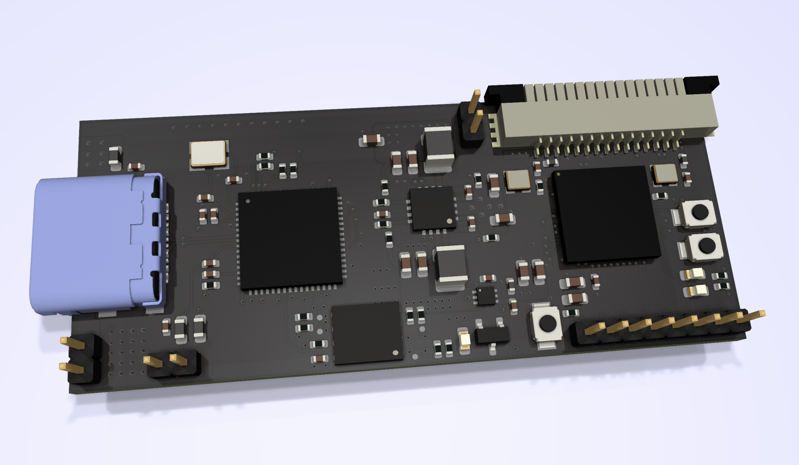

# BAJIU-Lite

BAJIU-Lite is a resource-rich FPGA development board, which is dedicated to facilitate rapid FPGA development, small and convenient, right out of the box. We are also committed to building the most convenient RISC-V development board, which is convenient for you to quickly customize the CPU you need according to your needs.  

# Hardware
## For FPGA developers
| Feature | Count |
| :-----| ----:
| LEs | 19728 |
| BRAMs 5k| 1044 |
| Multipliers 18x18| 36|
| PLLs| 5 |
| GPIOs | 8 |
| Button | 3 |
| LED | 3 |
| UART | 2 |
| JTAG | 1 |
| SPI | 1 |
| FLASH | 128 Mbits |
---
## For AI developers
 - MIPI CSI 1x
 - MIPI DSI 1x
 - AI Inference(TBD)

---
## For RISC-V developers
 - Latest version of GCC
 - QtCreator IDE
 - QtCreator IDE Debuger Plugin for RISC-V
 - CMake Build System
 - Integrated serial port
#
# Get Started

1. Download Efinity Tool from [Efinix](https://www.efinixinc.com)
   - [Windows 2021.2](https://efinixinc.com/dl/efinity-2021.2.323-windows-x64.msi)
   - [Linux 2021.2](https://efinixinc.com/dl/efinity-2021.2.323-ubuntu-x64.tar.bz2)
2. Open and compile the project
    1. Open Efinity 
    2. Click on File in the menu bar
    3. Click on Open Project
    4. Find the downloaded project "hello_uart"
    5. Click Compile in the dashboard
3. Run
    1. Connect BAJIU-Lite with USB cable
    2. Click the Programer icon in the menu bar
    3. Select the bit file
    4. Click on "Start Program"

<!--  -->
#
# Manual

- Efinity
  - [Efinity Software User Guide](https://efinixinc.com/support/docsdl.php?s=ef&pn=UG-EFN-SOFTWARE)
  - [Efinity Software Installation User Guide](https://efinixinc.com/support/docsdl.php?s=ef&pn=UG-EFN-INSTALL)
  - [Efinity Trion Tutorial](https://efinixinc.com/support/docsdl.php?s=ef&pn=UG-EFN-TUTORIAL)
  - [Trion Interfaces User Guide](https://efinixinc.com/support/docsdl.php?s=ef&pn=UG-TINTF)
- Hardware
  - [T20 Data Sheet](https://efinixinc.com/support/docsdl.php?s=ef&pn=DST20)
  - [Pinmap](pinmap/pinmap.pdf)