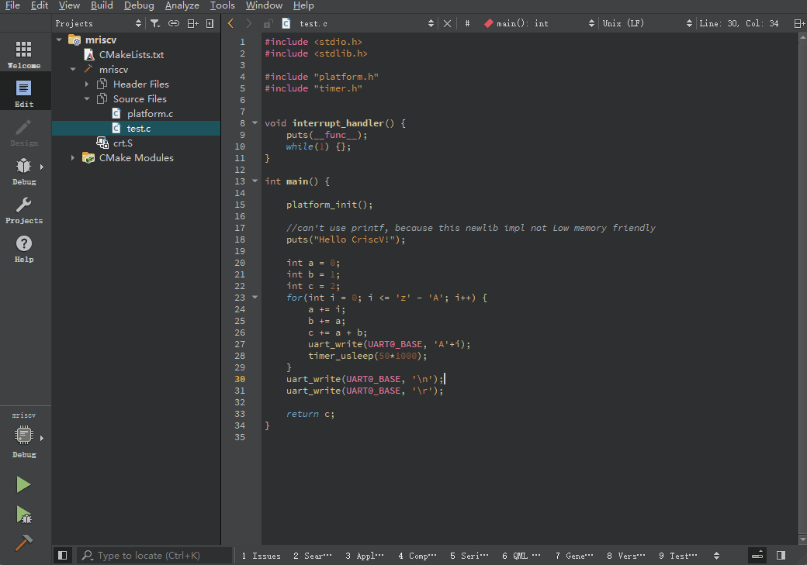

**CRiscV** is a open source Soc based on VexRiscv, which is currently mainly adapted to the BAJIU-Lite development board. It contains the following features.

## Get Started

1. Use [Efinity](https://github.com/DragonLiTec/BAJIU-Lite/blob/main/README.md) Tools to Open CRiscV Project
2. Flash bitstream to BAJIU-Lite Board
3. Use [RVDE](https://github.com/DragonLiTec/RVDE) To open sw CMakeList.txt
   - Build
   - Run
   - Debug
## Features
- RV32I[M][A][F[D]][C] instruction set
- Pipelined from 2 to 5+ stages ([Fetch*X], - - - Decode, Execute, [Memory], [WriteBack])
- Branch prediction
- Instruction, data cache
- Multiplication and division unit
- OpenOCD debugging features

## For BAJIU-Lite
- 100MHz main frequency
- Apb expansion interface
- 10 GPIO interfaces
- UART
- SPI
- I2C
- JTAG
- TIMER
- 40KB on-chip memory
- 128Mib flash
- BSP
- Driver
- RVDE development tools

## Preview

